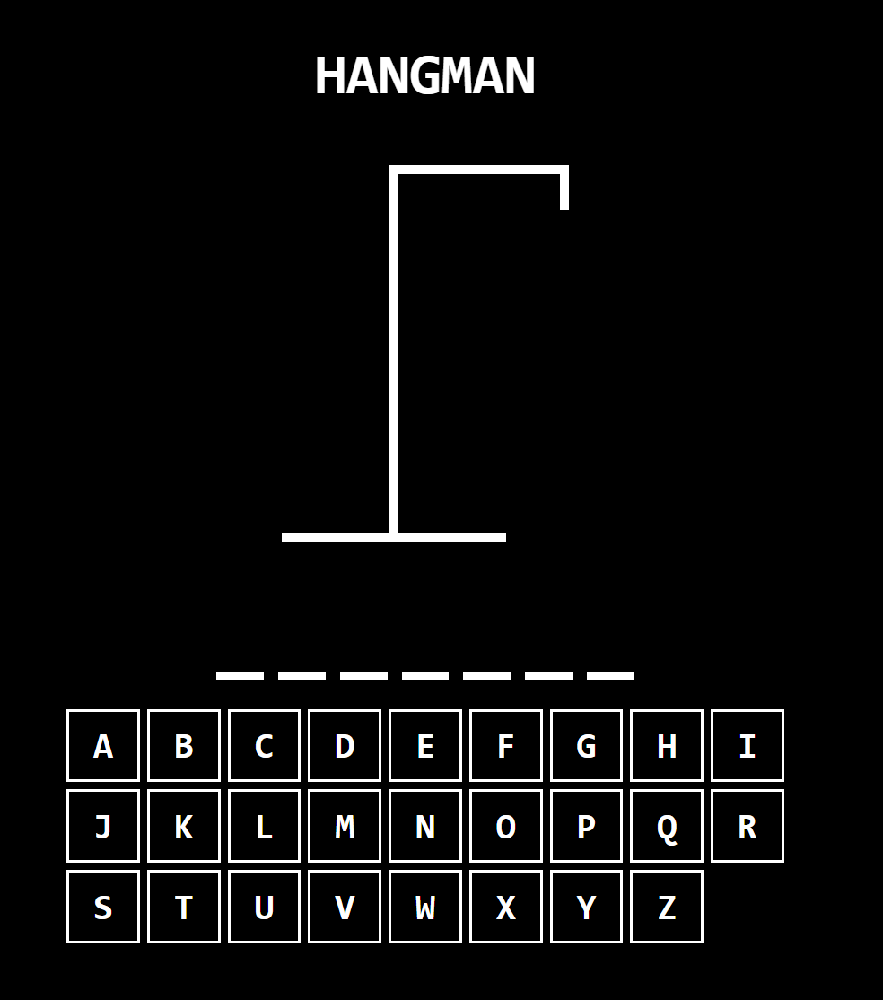

# Hangman Game

## Description

A game in which the object is for the user to guess the letters of an unknown word before the computer who knows the word creates a stick figure of a hanged man by drawing one line for each incorrect guess. This game is designed to be played by either clicking the letters or by using the keyboard.  

## Technologies used

- TypeScript
- React
- Vite
- JSX
- Javascript
- HTML
- CSS

## Link to deployed application

[Click here to play](https://mdkgray.github.io/HaNgMaN-GaMe/)

## Screenshots

## Installation 

The application is installed with the following command: 

`npm install` 

The application is run with the following command: 

`npm run dev`

The application is built with the following command: 

`npm run build`

## Contributing

Fork the repo and/or get in contact with the authors to suggest changes or contributions. 

## Questions

### For further information contact using the following:

#### GitHub: [mdkgray](https://github.com/mdkgray)

#### Email: mdkulen@gmail.com